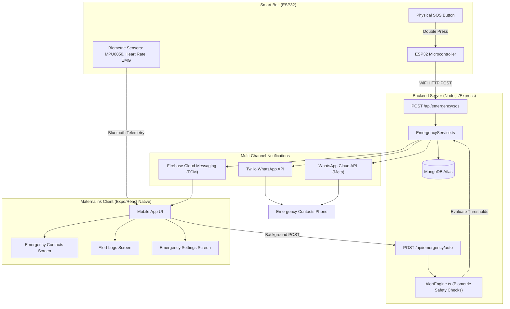

# Maternalink: Pregnancy Guidance & Emergency Alert System

The **Maternalink Smart Maternal Belt** platform is a comprehensive care solution for to-be-mothers. This repository hosts two main functional modules on the `guidance-system` branch:
1. **Pregnancy Guidance System**: A rule-based module providing weekly medically-researched maternal guidelines.
2. **Emergency Alert System**: An IoT-integrated module that automatically detects dangerous maternal conditions (stress, falls, contraction surges, fetal distress) or processes manual SOS signals, sending multi-channel notifications (WhatsApp and Push Notifications) in real time.

---

## 🎨 System Architecture



*For details on guidance data flows, check the [Pregnancy Guidance Overview](docs/PREGNANCY_GUIDANCE_SYSTEM_OVERVIEW.md).*

---

## 🚀 Key Features

### 1. Pregnancy Guidance System
* **Weekly Guidance Dashboard**: Renders scrollable cards categorized by health priorities (Nutrition, Hydration, Exercise, Medical Tests, Doctor Visits, and Precautions) based on the user's current pregnancy week.
* **Onboarding Profile Setup**: Enforces profile metrics setup (Week, Delivery Date, Weight, Blood Group) on first login.

### 2. Emergency Alert System
* **Manual Emergency (SOS Button)**: Handled by the ESP32 belt sending coordinates and triggers.
* **Automatic Emergency Detection**: Runs background rules evaluating contractions, heart rate, stress level, and fall vectors.
* **Multiple Risk Factor Aggregation**: Automatically detects when multiple parameters are unsafe, generating a `critical` severity aggregate alert.
* **Emergency Contacts CRUD**: Allows saving, editing, and prioritising contact profiles with input number validation.
* **Custom Alert Settings**: Toggle switches in settings to enable or disable WhatsApp alerts, push notifications, auto alerts, and the SOS button.
* **Expandable Incident History Logs**: Renders past alerts with delivery statuses and collapsible biometric sensor snapshots.

---

## 🗄️ Database Schema Details

The database is built on **MongoDB Atlas** via **Mongoose**:
1. **`users`**: Demographics and account credentials.
2. **`pregnancyProfiles`**: Tracks week, trimester, delivery date, weight, and blood group.
3. **`guidanceRules`**: Thresholds (`minWeek` to `maxWeek`) mapping guidelines.
4. **`emergencyContacts`**: Stores arrays of user-registered emergency contacts:
   ```json
   {
     "userId": "ObjectId",
     "contacts": [{ "name": "string", "relation": "string", "phone": "string", "whatsapp": "string", "priority": "number" }]
   }
   ```
5. **`emergencyAlerts`**: Incident details, severity, message, sensor telemetry, and dispatch states.
6. **`emergencySettings`**: Preferences for WhatsApp/Push notification channels and trigger states.

---

## ⚙️ Backend Installation & Setup

1. **Navigate to the backend folder**:
   ```bash
   cd backend
   ```
2. **Install dependencies**:
   ```bash
   npm install
   ```
3. **Create a `.env` file** in `backend/` with the following variables:
   ```env
   PORT=5000
   MONGODB_URI=mongodb://localhost:27017/maternalink
   JWT_SECRET=your_jwt_secret_key_here
   NODE_ENV=development

   # (Optional) WhatsApp & Firebase Configuration
   WHATSAPP_PROVIDER=twilio # 'twilio' or 'meta'
   TWILIO_SID=your_twilio_sid_here
   TWILIO_AUTH_TOKEN=your_twilio_auth_token_here
   TWILIO_WHATSAPP_NUMBER=+14155238886 # Twilio Sandbox Number
   
   WHATSAPP_CLOUD_API_TOKEN=your_meta_token_here
   WHATSAPP_PHONE_NUMBER_ID=your_meta_phone_number_id_here
   
   FIREBASE_KEYS=your_firebase_admin_sdk_json_string_here
   ```
   *Note: If Twilio, Meta, or Firebase keys are omitted, the services fallback to a mock/dry-run logging mode so local testing does not throw errors.*
4. **Seed the pregnancy guidance rules**:
   ```bash
   npm run seed
   ```
5. **Start the Express server**:
   ```bash
   npm run dev
   ```

---

## 📱 Mobile Frontend Installation & Setup

1. **Navigate to the frontend folder**:
   ```bash
   cd frontend
   ```
2. **Install dependencies**:
   ```bash
   npm install
   ```
3. **Configure local network IP**:
   Open [api.ts](frontend/src/core/config/api.ts) and modify `API_HOST` to match your PC's current LAN IP address (found via `ipconfig` on Windows or `ifconfig` on macOS/Linux):
   ```typescript
   export const API_HOST = 'http://<your-pc-ip>:5000';
   ```
4. **Start Metro Bundler**:
   ```bash
   npx expo start --clear
   ```
5. **Open Expo Go** on your physical device, tap "Scan QR Code", and scan the QR code in the terminal.

---

## 🧪 Simulation & Testing

### 1. Execute Unit Tests
Verify guidance logic and telemetry signal processor calculations:
```bash
cd backend
npm run test
```

### 2. Run Local Emergency Simulations
We have provided scripts to test Mongoose writes, rule engines, and provider integrations:
* **Simulate General Workloads** (SOS, Fall triggers, Multiple risks, Normal parameters):
  ```bash
  npx ts-node-dev --transpile-only src/simulateEmergency.ts
  ```
* **Simulate Actual Device Dispatch**:
  1. Add your phone number as a contact under **Settings > Emergency Contacts** in the app.
  2. If using Twilio Sandbox, opt-in by sending `join <sandbox-keyword>` to `+1 415 523 8886`. If using Meta, add your number as a verified Recipient.
  3. Execute the script to send a real WhatsApp text to your registered phone:
     ```bash
     npx ts-node-dev --transpile-only src/triggerTestAlert.ts
     ```

---

## 🛠️ Connection Troubleshooting

### 1. Mobile app fails with Network Error
* Make sure both your phone and PC are connected to the **same Wi-Fi network**.
* Check that `API_HOST` in `api.ts` matches the IP address Metro is listening on (e.g., `exp://10.104.47.11:8081` ➔ IP is `10.104.47.11`).
* Add an inbound rule in your Windows Firewall to allow TCP traffic on port `5000`.

### 2. Android USB adb reverse
If connected via USB, run the following to bypass Wi-Fi issues:
```bash
adb reverse tcp:5000 tcp:5000
```
Then configure `api.ts` to use `http://localhost:5000`.

