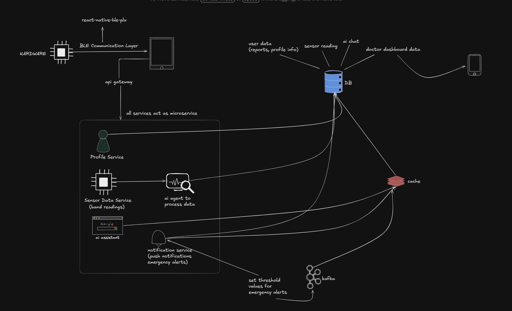

# Maternalink: Pregnancy Guidance System

The **Pregnancy Guidance System** is a rule-based module of the **Maternalink Smart Maternal Belt** platform. It provides personalized, medically researched guidelines to patients based on their current pregnancy week, utilizing a MongoDB-driven rules engine instead of AI generation.

---

## 🎨 System Architecture



*For a detailed look at the data flow, architecture diagram, and logic details, see the [Pregnancy Guidance Overview](docs/PREGNANCY_GUIDANCE_SYSTEM_OVERVIEW.md).*

---

## 🚀 Key Features

*   **Pulsing Splash Screen**: A beautiful maternal-branded splash screen with fade-in and scale animations.
*   **Onboarding and Authentication**: User registration (Name, Email, Password, Age) and secure JWT authentication.
*   **Onboarding Profile Setup**: Enforces entering pregnancy variables (Pregnancy Week, Expected Delivery Date, Weight, Blood Group) on first login.
*   **Weekly Guidance Dashboard**: Retrieves rules based on the user's pregnancy week range and renders scrollable cards categorized by health priorities:
    *   **🥗 Nutrition Tips**: Healthy indicators (Green tag)
    *   **🏃‍♀️ Exercise Tips**: Healthy indicators (Green tag)
    *   **💧 Hydration Tips**: Fluid balance recommendations (Blue tag)
    *   **🔬 Medical Tests**: Diagnostic checks schedule (Yellow tag)
    *   **👩‍⚕️ Doctor Visits**: Actionable checkups reminders (Orange tag)
    *   **⚠️ Precautions**: Warnings and critical items to avoid (Red tag)
*   **Account Settings**: Easily edit/update pregnancy variables or securely sign out.

---

## 🗄️ Database Schema Details

The database is built on **MongoDB Atlas** via **Mongoose**:

1.  **`users`**: Manages basic mother credentials and demographics.
2.  **`pregnancyProfiles`**: Tracks current pregnancy stats (pregnancy week, dynamically computed trimester, delivery date, weight, blood group).
3.  **`guidanceRules`**: Contains matching thresholds (`minWeek` to `maxWeek`) and associated array arrays for recommendations.

---

## ⚙️ Backend Installation & Setup

1.  Navigate to the backend directory:
    ```bash
    cd backend
    ```
2.  Install dependencies:
    ```bash
    npm install
    ```
3.  Create a `.env` file in the `backend/` directory:
    ```env
    PORT=5000
    MONGODB_URI=mongodb://localhost:27017/maternalink
    JWT_SECRET=your_jwt_secret_key_here
    NODE_ENV=development
    ```
4.  **Seed the database rules**:
    ```bash
    npm run seed
    ```
5.  Start the Express server in development mode:
    ```bash
    npm run dev
    ```

### API Endpoints
*   `POST /api/auth/register` - Create user profile
*   `POST /api/auth/login` - Authenticate and fetch profile
*   `POST /api/profile` - Create gestational profile
*   `PUT /api/profile/:id` - Update profile metrics
*   `GET /api/guidance/:userId` - Retrieve week-specific guidelines

---

## 📱 Mobile Frontend Installation & Setup

1.  Navigate to the frontend directory:
    ```bash
    cd frontend
    ```
2.  Install dependencies:
    ```bash
    npm install
    ```
3.  **Configure local network IP**:
    To allow your phone to communicate with the PC server, locate your PC's IP address (run `ipconfig` on Windows or `ifconfig` on macOS). Open [api.ts](frontend/src/core/config/api.ts) and replace the host IP with your computer's IP:
    ```typescript
    export const API_HOST = 'http://10.81.127.11:5000'; // Replace with your active IP
    ```
4.  Start Metro Bundler with cache reset:
    ```bash
    npx expo start --clear
    ```
5.  Open **Expo Go** on your Android or iOS device, tap "Scan QR Code", and scan the QR code printed in your terminal.

---

## 🧪 Verification & Unit Testing

The backend includes a comprehensive Jest test suite that verifies the trimester calculations, profile generation logic, and rule-matching queries.

To execute the unit tests:
```bash
cd backend
npm run test
```

---

## 🛠️ Connection Troubleshooting

### 1. Request fails with "Unable to sign in" (Network Error)
*   **Cause**: The phone cannot ping your computer over Wi-Fi.
*   **Fix**:
    *   Make sure both devices are on the **same Wi-Fi**.
    *   **Hotspot Fallback**: Connect your PC to your phone's mobile hotspot. Run `ipconfig` on the PC to find the new IP, update `API_HOST` in `api.ts`, and restart Metro.
    *   **Firewall Rule**: Open Windows Defender Firewall and allow inbound TCP traffic on Port `5000`.

### 2. Android USB adb reverse
If you are testing on an Android device plugged in via USB, you can completely bypass Wi-Fi and firewall issues by routing localhost ports:
```bash
adb reverse tcp:5000 tcp:5000
```
Then configure `api.ts` to use `http://localhost:5000`.
