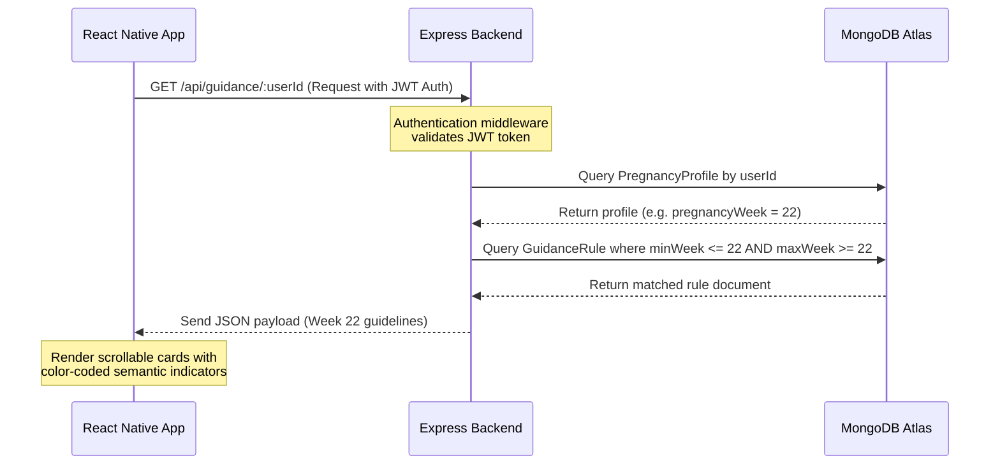

# Pregnancy Guidance System Architecture Overview

This document explains the underlying logic, database design, and operational details of the **Pregnancy Guidance System** module of the **Maternalink** platform.

---

## 💡 Core Philosophy: Rules-Based vs. Sensor-Based Data

The Pregnancy Guidance System operates on a **medically researched, rule-based matching mechanism** mapped directly to the user's gestational age (pregnancy week). 

Here is how the guidance feature relates to other modules in the Smart Maternal Belt platform:

```
+-------------------------------------------------------------------------------+
|                        MATERNALINK PLATFORM ARCHITECTURE                      |
+-------------------------------------------------------------------------------+
                                        |
       +--------------------------------+--------------------------------+
       |                                                                 |
       v                                                                 v
+-----------------------------+                           +-----------------------------+
|  Pregnancy Guidance System  |                           |  IoT Contraction Monitor     |
|  (This Module)              |                           |  (Hardware telemetry)       |
+-----------------------------+                           +-----------------------------+
       |                                                                 |
       v                                                                 v
- Logical Basis: Gestational Week                         - Logical Basis: Real-time sensor feed
- Source: Medically Researched Rules                      - Source: EMG, ADC, temperature, MPU6050
- Content: Nutrition, Tests, Precautions                 - Content: Contraction frequency, intensity
- Generation: Static Database Match                       - Generation: Digital Signal Processing (DSP)
       |                                                                 |
       +--------------------------------+--------------------------------+
                                        |
                                        v
                            +-----------------------+
                            | Combined Mobile App   |
                            | (Dashboard View)      |
                            +-----------------------+
```

### 1. On what basis does the Guidance Feature work?
The guidance feature works **strictly on the basis of the patient's current pregnancy week**. 
- It **does not** use AI generation.
- It **does not** dynamically alter general medical advice using live telemetry data (such as SpO2, heart rate, or sleep tracking). 
- *Why?* Medical standards for pregnancy (such as when to undergo a Gestational Diabetes screen, when to get a Rhogam injection, or what foods to avoid in the first trimester) are strictly determined by **gestational age** (weeks of pregnancy), not by temporary physical readouts like daily heart rate.

### 2. How does the IoT telemetry tie into the platform?
The IoT contraction monitoring system is a **parallel module** on the Maternalink platform. 
*   The belt's hardware sensors (flex sensor, EMG, and temperature) feed telemetry data directly to the **Contraction Monitoring Screen** to compute contraction frequency, duration, and intensity using digital signal processing (DSP).
*   The **Guidance Screen** focuses on general maternal health advice (like nutrition, hydration, exercise guidelines, doctor visits, and precautions) matching the specific stage of pregnancy.

---

## ⚙️ Data Flow & Logic

When a user logs in and visits the **Guidance Screen**, the system performs the following sequence:



---

## 🗄️ Database Collections Structure

The system utilizes three primary MongoDB collections to fetch and compute this data:

### 1. `users`
Stores user authentication details.
```json
{
  "_id": "ObjectId",
  "name": "Jane Doe",
  "email": "jane@example.com",
  "password": "hashed_password_string",
  "age": 28,
  "createdAt": "Date"
}
```

### 2. `pregnancyProfiles`
Maps the user to their pregnancy parameters.
```json
{
  "_id": "ObjectId",
  "userId": "ObjectId",
  "pregnancyWeek": 22,
  "trimester": 2, // Automatically calculated by backend (1, 2, or 3)
  "expectedDeliveryDate": "2026-10-15T00:00:00Z",
  "weight": 68.5,
  "bloodGroup": "O+",
  "createdAt": "Date",
  "updatedAt": "Date"
}
```

### 3. `guidanceRules`
Stores the medically researched rules for week ranges.
```json
{
  "_id": "ObjectId",
  "minWeek": 21,
  "maxWeek": 24,
  "nutritionTips": [
    "Monitor sodium intake to avoid excessive fluid retention...",
    "Increase protein intake with lean meats, eggs, tofu..."
  ],
  "hydrationTips": [
    "Drink 10-12 cups of water daily to flush toxins..."
  ],
  "exerciseTips": [
    "Continue walking, swimming, and modified strength training..."
  ],
  "medicalTests": [
    "Gestational Diabetes Screening (Glucose challenge test)...",
    "Repeat Complete Blood Count (CBC) for anemia..."
  ],
  "doctorVisits": [
    "Attend month 6 prenatal checkup: check fundal height..."
  ],
  "precautions": [
    "Avoid prolonged standing or sitting to prevent blood clots...",
    "Avoid heavy lifting over 20 lbs..."
  ]
}
```

---

## 🎨 Visual Color-Coding Scheme on Mobile

The frontend displays these recommendations in distinct scrollable sections, styled with **semantic colors** designed to communicate medical priority and attention level:

| Section | Color Tag | Category Meaning | Description of Advice |
| :--- | :--- | :--- | :--- |
| **🥗 Nutrition Tips** | **Green** | Healthy | General healthy diet, calories, and vitamin foods. |
| **🏃‍♀️ Exercise Tips** | **Green** | Healthy | Safe physical movements and stretches for the stage. |
| **💧 Hydration Tips** | **Blue** | Info | Hydration limits, amniotic fluid maintenance. |
| **🔬 Medical Tests** | **Yellow** | Attention | Lab tests, glucose tests, ultrasound schedule checks. |
| **👩‍⚕️ Doctor Visits** | **Orange** | Warning | Scheduled prenatal checkup items (measuring fundal height, etc.). |
| **⚠️ Precautions** | **Red** | Emergency | Warning indicators, items to avoid, signs of complications. |
